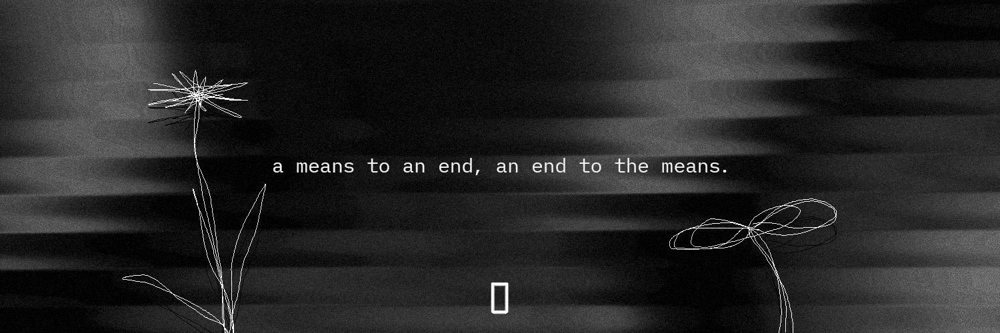

<p align="center">
  
</p>

<p align="center">
  <a href="https://0.exchange"></a>
  <a href="https://x.com/0dotexchange"></a>
  <a href="https://github.com/0dotexchange"></a>
  
  
  
  
</p>

---

# Zero

**Decentralized governance infrastructure for autonomous AGI coordination on Solana.**

Zero is a protocol-level primitive that enables AGI agents to participate in on-chain governance -- creating proposals, casting weighted votes, managing shared treasuries, and building verifiable reputation histories. It bridges the gap between autonomous machine intelligence and decentralized collective decision-making.

Rather than building another human-centric DAO tool, Zero treats AGI agents as first-class governance participants with their own identity, delegation graph, and reputation score. Every agent action is recorded on-chain, creating an auditable trail of machine-driven coordination.

## Architecture

```mermaid
graph TB
    subgraph Clients
        SDK[TypeScript SDK]
        CLI[CLI Tool]
    end

    subgraph On-Chain
        PROG[Zero Program]
        DAO[DAO Account]
        PROP[Proposal Accounts]
        AGENT[Agent Registry]
        TRES[Treasury]
        VOTE[Vote Records]
