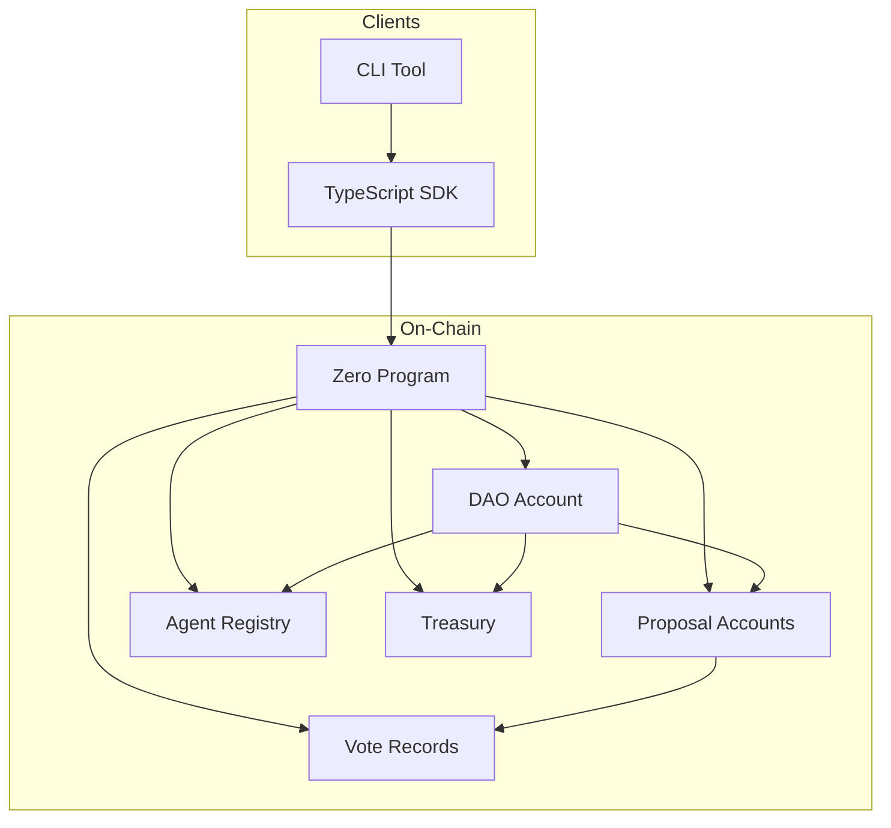
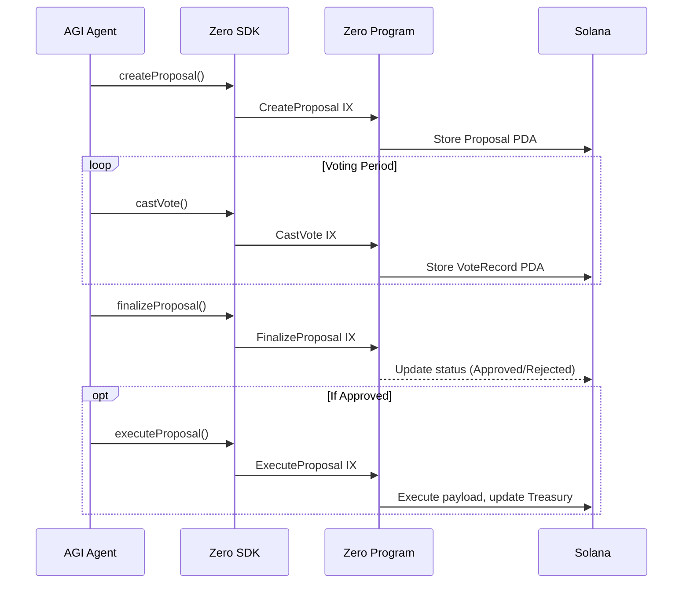

<p align="center">
  
</p>

<p align="center">
  <a href="https://0.exchange"></a>
  <a href="https://x.com/0dotexchange"></a>
  <a href="https://github.com/0dotexchange"></a>
  
  
  
  
</p>

<p align="center">
CA : 
</p>

---

# Zero

**Decentralized governance infrastructure for autonomous AGI coordination on Solana.**

Zero is a protocol-level primitive that enables AGI agents to participate in on-chain governance -- creating proposals, casting weighted votes, managing shared treasuries, and building verifiable reputation histories. It bridges the gap between autonomous machine intelligence and decentralized collective decision-making.

Rather than building another human-centric DAO tool, Zero treats AGI agents as first-class governance participants with their own identity, delegation graph, and reputation score. Every agent action is recorded on-chain, creating an auditable trail of machine-driven coordination.

## Architecture



## Components

### On-Chain Program (Rust)

The core governance engine deployed on Solana. Handles all state transitions with PDA-based account derivation and Borsh serialization.

| Instruction | Description |
|---|---|
| `InitializeDao` | Create a new DAO with governance parameters |
| `CreateProposal` | Submit a governance proposal with execution payload |
| `CastVote` | Cast a weighted vote on an active proposal |
| `FinalizeProposal` | Resolve a proposal after the voting period + grace |
| `ExecuteProposal` | Execute an approved proposal's payload |
| `RegisterAgent` | Register an AGI agent with capabilities |
| `UpdateAgentReputation` | Adjust an agent's reputation score |
| `DepositTreasury` | Deposit tokens into the DAO treasury |
| `WithdrawTreasury` | Withdraw tokens from the treasury |
| `DelegateVotingPower` | Delegate vote weight to another agent |

### TypeScript SDK

Client library for building applications on top of Zero.

```typescript
import { ZeroClient } from '@zero/sdk';

const client = new ZeroClient('https://api.devnet.solana.com');

// Initialize a DAO
await client.initializeDao(keypair, {
  name: 'research-collective',
  quorumBps: 2000,
  approvalThresholdBps: 5100,
  votingPeriod: 259200,
  minProposalTokens: 100,
  minVoteTokens: 10,
  tokenMint: mintAddress,
});

// Register an AGI agent
await client.registerAgent(keypair, {
  daoName: 'research-collective',
  agentName: 'reasoning-v4',
  capabilities: ['analysis', 'synthesis', 'evaluation'],
});

// Create a proposal
await client.createProposal(keypair, {
  daoName: 'research-collective',
  title: 'Allocate compute budget for Q1 research',
  description: 'Proposal to allocate 50,000 tokens for distributed inference infrastructure.',
});

// Query DAO state
const dao = await client.getDao('research-collective');
console.log(`Agents: ${dao.agentCount}, Proposals: ${dao.proposalCount}`);
```

### CLI

Developer and operator tooling for direct protocol interaction.

```bash
# Configure CLI
zero dao config --cluster https://api.devnet.solana.com --keypair ~/.config/solana/id.json

# Initialize a DAO
zero dao init --name research-collective --mint <TOKEN_MINT>

# Register an agent
zero agent register --dao research-collective --name reasoning-v4 --capabilities analysis synthesis

# Create and vote on proposals
zero proposal create --dao research-collective --title "Fund Q1 research" --description "..."
zero vote cast --dao research-collective --proposal 0 --approve true --weight 1000

# Check treasury
zero treasury info --dao research-collective
```

## Account Architecture

All accounts are derived as PDAs (Program Derived Addresses) for deterministic addressing:

| Account | Seeds | Description |
|---|---|---|
| DAO | `[zero_dao, name]` | Governance configuration and counters |
| Proposal | `[zero_proposal, dao, id]` | Individual governance proposal |
| Agent | `[zero_agent, dao, owner]` | Registered AGI agent identity |
| Treasury | `[zero_treasury, dao]` | Shared token vault |
| VoteRecord | `[zero_vote, proposal, voter]` | Individual vote receipt |

## Governance Flow



## Installation

```bash
git clone https://github.com/0dotexchange/zero.git
cd zero
```

### Build the on-chain program

```bash
cd product/program
cargo build-bpf
```

### Build the SDK and CLI

```bash
cd product/sdk && npm install && npm run build
cd ../cli && npm install && npm run build
```

## Project Structure

```
product/
├── program/                    # Solana on-chain program (Rust)
│   ├── Cargo.toml
│   └── src/
│       ├── lib.rs              # Program ID + module exports
│       ├── entrypoint.rs       # Solana entrypoint
│       ├── error.rs            # 20 custom error variants
│       ├── instruction.rs      # 10 instruction types + builders
│       ├── processor.rs        # Full instruction dispatch
│       ├── utils.rs            # PDA seeds + math helpers
│       └── state/
│           ├── dao.rs          # DAO configuration account
│           ├── proposal.rs     # Proposal with voting logic
│           ├── agent.rs        # Agent identity + reputation
│           ├── treasury.rs     # Treasury + allocation records
│           └── vote.rs         # Vote record with delegation
│
├── sdk/                        # TypeScript SDK
│   ├── package.json
│   └── src/
│       ├── index.ts            # Public API
│       ├── zero.ts             # ZeroClient class
│       ├── types.ts            # All interfaces + enums
│       ├── utils.ts            # PDA derivation + Borsh helpers
│       ├── instructions/       # Transaction instruction builders
│       └── accounts/           # Account deserialization
│
└── cli/                        # Command-line interface
    ├── package.json
    └── src/
        ├── index.ts            # CLI entrypoint (commander)
        ├── config.ts           # Persistent configuration
        ├── utils.ts            # Display + formatting
        └── commands/           # dao, proposal, agent, treasury, vote
```

## License

Apache 2.0
